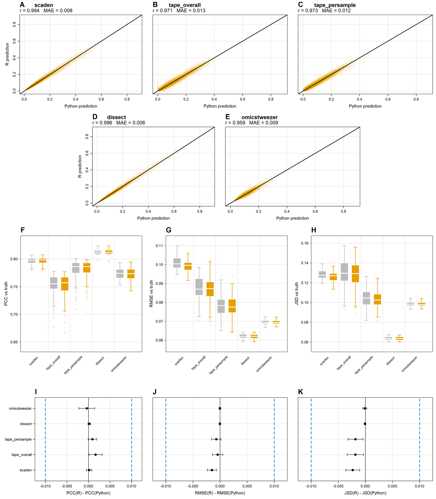

```{r setup, include = FALSE}
knitr::opts_chunk$set(collapse = TRUE, comment = "#>", eval = FALSE)
```

# Why these exist

Most deep-learning deconvolution tools are available only in Python. Many
wet-lab researchers work in R but not Python, which puts these methods out of
reach of the environments where the rest of their transcriptomics analysis
happens — preprocessing, visualisation, statistics, functional interpretation,
and the `Seurat` and `SingleCellExperiment` structures those depend on.

This package provides native R implementations of Scaden, TAPE, DISSECT, and
OmicsTweezer, written in `torch` for R. They accept `Seurat` and
`SingleCellExperiment` objects directly and support GPU acceleration through
the same `device` argument.

# The shared workflow

All four follow the same four stages:

| Stage | Scaden | TAPE | DISSECT | OmicsTweezer |
|---|---|---|---|---|
| Simulate | `scaden_sim_pb()` | `tape_simulate()` | `dissect_simulate()` | `omics_simulate()` |
| Process | `scaden_process()` | `tape_process()` | `dissect_process()` | `omics_process()` |
| Train | `scaden()` | `tape_train()` | `dissect_prop()` | `omics_train()` |
| Predict | `scaden_predict()` | `tape_predict()` | (returned by train) | `omics_predict()` |
| Wrapper | — | `tape()` | `dissect()` | `omics_tweezer()` |

Each method has its own page with a full worked example:

- **Scaden** — a three-model MLP ensemble. The simplest of the four and a
  reasonable first thing to run.
- **TAPE** — an autoencoder with a tissue-adaptive refinement stage that tunes
  the model on the target bulk data itself.
- **DISSECT** — semi-supervised consistency regularization, plus optional
  cell-type-specific expression estimation.
- **OmicsTweezer** — domain adaptation aligning simulated and real samples in a
  shared embedding space.

# Input conventions

Two things trip people up when moving between methods.

**Bulk orientation.** `tape_process()`, `omics_process()`, and
`dissect_process()` expect a **genes × samples** matrix. `scaden_process()`
infers orientation from the gene names, so either layout works there.

**The cell-type column.** Defaults differ: `"CellType"` for TAPE and
OmicsTweezer, `"celltype"` for DISSECT, and none at all for Scaden, which
requires `celltype_col` explicitly. Pass it explicitly in every case and the
question disappears.

# Fidelity to the originals

Agreement with the Python implementations was evaluated using ten independent
model runs across ten COVID-19 pseudo-bulk datasets, with both versions
receiving identical training and test data — 100 matched prediction sets per
method.

```{r fidelity-fig, echo = FALSE, eval = TRUE, out.width = "100%", fig.cap = "Prediction concordance and performance equivalence between R and Python implementations. (A-E) Agreement of predicted cell-type proportions across ten datasets and ten seeds. (F-H) Accuracy against ground truth. (I-K) Paired R-Python differences with intervals; dashed lines mark the ±0.01 equivalence margin."}

```

Correlations between R and Python predictions ranged from 0.959 for
OmicsTweezer to 0.996 for DISSECT, with mean absolute differences in predicted
proportions between 0.0057 and 0.0140. Performance against known proportions
was similarly preserved: mean R-Python differences did not exceed 0.0088 for
Pearson correlation, 0.0015 for RMSE, or 0.0024 for JSD.

For context, a 0.01 difference in an individual cell-type estimate is one
percentage point, which matters most for populations below 1% — the abundance
range where the original Python implementations already struggle. Cross-language
differences were generally within the run-to-run stochastic variation of the
Python methods themselves.

# Comparing methods

Since all four return a samples × cell-types matrix with matching names,
comparison is a matter of collecting them:

```{r compare}
preds <- list(
  scaden       = scaden_pred$average_output,
  tape         = tape_res$pred,
  dissect      = dissect_prop_res$fractions,
  omicstweezer = ot_pred
)

rmse_table <- sapply(preds, function(p) {
  quasar_prop_metrics(p, truth)$cell_type_rmse
})

round(rmse_table, 4)
```

See **Utilities** for what `quasar_prop_metrics()` returns.

# References

- Menden, K., Marouf, M., Oller, S., Dalmia, A., Magruder, D. S., Kloiber, K.,
  ... & Bonn, S. (2020). Deep learning-based cell composition analysis from
  tissue expression profiles. *Science Advances*, 6(30), eaba2619.
- Chen, Y., Wang, Y., Chen, Y., Cheng, Y., Wei, Y., Li, Y., Wang, J., Wei, Y.,
  Chan, T.-F., & Li, Y. (2022). Deep autoencoder for interpretable
  tissue-adaptive deconvolution and cell-type-specific gene analysis. *Nature
  Communications*, 13(1), 6735.
- Khatri, R., Machart, P., & Bonn, S. (2024). DISSECT: deep semi-supervised
  consistency regularization for accurate cell type fraction and gene
  expression estimation. *Genome Biology*, 25(1), 112.
- Yang, X., Zhao, F., Ren, T., Chen, C., Byrne, K. T., Danilov, A. V., ... &
  Xia, Z. (2025). OmicsTweezer: A distribution-independent cell deconvolution
  model for multi-omics data. *Cell Genomics*, 5(9).

If you use any of these R implementations, cite both the QUASAR paper and the
original publication of the method.
